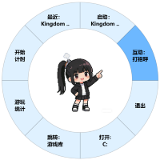

# 蒸汽娘 (SteaMiss)

集成了一些Steam常见的功能，形象使用豆包AI创作





## ✨ 主要功能

### 🎮 Steam 游戏管理
- **多账号支持**：支持多个子账号，自动聚合所有账号的游戏数据
- **快速启动**：一键启动最近游玩的游戏或收藏的游戏
- **游戏统计**：查看游戏库统计信息，包括账号价值、游戏总数、总游玩时间等
- **Steam 页面快捷访问**：快速打开 Steam 库、社区、下载等页面

### 📁 系统功能
- **快速打开文件夹**：配置常用文件夹路径，一键打开存档路径、本地文件路径
- **系统托盘**：系统托盘处设置置顶、隐藏等选项，双击托盘图标可激活宠物窗口
- **设置管理**：图形化设置界面，方便配置各项功能

### ⏱️ 计时器
- **智能计时**：打开一个读秒计时器，显示在桌面宠物下方
- **计时管理**：支持开始、暂停、继续、结束计时
- **时间记录**：自动保存计时记录到本地文件

### 🐾（没有任何桌宠逻辑的）桌面宠物
- **智能交互**：右键点击显示环形菜单，快速访问各种功能
- **智能逻辑**：还没有加入任何行为逻辑或状态机

## 🚀 快速开始（exe）

### 启动
1. 在release中下载exe文件
2. 双击启动
3. **会在exe文件同级目录下生成config文件夹**

### （必须！）获取 Steam API 密钥

1. 访问 [Steam Web API Key](https://steamcommunity.com/dev/apikey)
2. 登录你的 Steam 账号
3. 填写域名（可以填写 `localhost`）
4. 复制生成的 API 密钥到配置文件
5. 如果没有，大多数steam相关的功能无法使用

### （必须！）获取 Steam ID

1. 访问 [Steam ID Finder](https://www.steamidfinder.com/)
2. 输入你的 Steam 个人资料链接
3. 复制 Steam ID64（格式：76561198xxxxxxxxx）

### 非常需要注意！

**Steam对于反爬非常严格，不要反复刷新数据**（虽然有设置了请求间隔）

**由于Steam公开的api没有获取价格的接口，所有和价格相关的都要去商店爬，所以都很慢，等待即可**

**没错，当然需要科学上网**

## 🚀 快速开始（源码）

### 环境要求

- Python 3.8 或更高版本
- Windows 10/11（当前版本主要支持 Windows）
- 使用Python 3.14开发

### 安装步骤

1. **克隆仓库**
   ```bash
   git clone https://github.com/SevenDespised/SteaMiss.git
   cd SteaMiss
   ```

2. **安装依赖**
   ```bash
   pip install -r requirements.txt
   ```

3. **配置设置**
   
   你可以启动桌宠后，在托盘的功能菜单中配置
   也可以编辑 `config/settings.json` 文件，配置以下信息：
   
   ```json
   {
       "steam_api_key": "你的Steam API密钥",
       "steam_id": "你的Steam ID",
       "steam_alt_ids": ["子账号1", "子账号2"],
       "steam_quick_launch_games": [
           {
               "name": "游戏名称",
               "appid": 游戏ID
           }
       ],
       "explorer_paths": ["文件夹路径1", "文件夹路径2", "文件夹路径3"],
       "explorer_path_aliases": ["别名1", "别名2", "别名3"]
   }
   ```

4. **运行程序**
   ```bash
   python main.py
   ```

## 📖 使用指南

### 基本操作

- **拖动宠物**：鼠标左键按住宠物窗口可以拖动到任意位置
- **右键菜单**：右键点击宠物显示环形菜单，选择功能
- **双击托盘**：双击系统托盘图标可激活宠物窗口
- **系统托盘**：右键托盘图标可访问设置、隐藏/显示、置顶等选项

### 功能说明

#### 🎮 Steam 游戏功能

**最近游戏**
- 在右键菜单中点击"最近"选项，可以快速启动最近游玩的游戏
- 支持显示最多 3 个最近游戏

**快速启动**
- 在配置文件中设置 `steam_quick_launch_games`，可以快速启动收藏的游戏
- 如果配置的游戏不足，会自动用最近游戏填充

**游戏统计**
- 在右键菜单中点击"统计"选项，打开游戏统计窗口
- 可以查看所有账号的游戏数据汇总

**Steam 页面**
- 在右键菜单中点击 Steam 页面选项，可以快速打开：
  - 游戏库
  - 社区
  - 下载页面
  - 商店等

#### ⏱️ 计时器功能

**开始计时**
- 在右键菜单中点击"开始计时"
- 计时器会显示在宠物窗口下方

**简单番茄钟**
- 设置每过多久提醒一次
- 设置每提醒一次暂停计时多久

#### 📁 文件夹功能

**配置路径**
- 在 `settings.json` 中配置 `explorer_paths` 和 `explorer_path_aliases`
- 可以设置最多 3 个常用文件夹路径
- 别名用于在菜单中显示，方便识别

**打开文件夹**
- 在右键菜单中点击"打开"选项
- 主选项打开第一个配置的路径
- 子选项可以打开其他配置的路径

#### 🐾 宠物交互

**打招呼**
- 在右键菜单中点击"互动：打招呼"
- 宠物会在系统托盘显示打招呼消息
- 消息内容可在配置文件中自定义

**置顶切换**
- 在系统托盘菜单中可以切换窗口置顶状态
- 置顶后窗口会始终显示在其他窗口之上

**隐藏/显示**
- 在系统托盘菜单中可以隐藏或显示宠物窗口
- 隐藏后宠物仍在后台运行

## ⚙️ 配置说明

### settings.json 配置项

| 配置项 | 说明 | 示例 |
|--------|------|------|
| `steam_api_key` | Steam API 密钥 | `"37A87AB6B92A6FA0C9D51437FFC1B1F1"` |
| `steam_id` | 主账号 Steam ID | `"76561198279072437"` |
| `steam_alt_ids` | 子账号 Steam ID 列表 | `["76561199365389945"]` |
| `steam_quick_launch_games` | 快速启动游戏列表 | `[{"name": "游戏名", "appid": 123456}]` |
| `steam_menu_pages` | Steam 页面菜单项 | `["library", "community", "downloads"]` |
| `explorer_paths` | 文件夹路径列表 | `["C:/Users/用户名/Documents"]` |
| `explorer_path_aliases` | 文件夹别名列表 | `["文档", "下载", "桌面"]` |
| `say_hello_content` | 打招呼消息内容 | `"你好！我是你的桌面宠物。"` |
| `timer_reminder_message` | 计时提醒消息内容 | `"时间到了！请注意休息。"` |

### 配置文件位置

- 主配置文件：`config/settings.json`
- Steam 数据缓存：`config/steam_data.json`
- 计时器日志：`config/timer_log.json`

## 🏗️ 项目结构

```
SteaMiss/
├── assets/                 # 资源文件（图片、图标等）
├── config/                 # 配置文件目录
│   ├── settings.json      # 主配置文件
│   ├── steam_data.json    # Steam 数据缓存
│   └── timer_log.json     # 计时器日志
├── src/                    # 源代码目录
│   ├── api/               # API 客户端
│   ├── core/              # 核心功能模块
│   │   ├── config_manager.py    # 配置管理
│   │   ├── feature_router.py  # 功能管理
│   │   ├── resource_manager.py # 资源管理
│   │   └── radial_handler.py        # UI 管理
│   ├── feature/           # 功能模块
│   │   ├── handlers/      # 功能处理器
│   │   ├── menu_builders/ # 菜单构建器
│   │   ├── steam_support/  # Steam 支持模块
│   │   └── timer_support/ # 计时器支持模块
│   ├── ui/                # UI 组件
│   ├── utils/             # 工具函数
│   ├── ai/                # AI 行为管理
│   ├── application.py    # 应用程序主类
│   └── pet.py             # 桌面宠物类
├── main.py                # 程序入口
├── requirements.txt       # Python 依赖
└── README.md             # 项目说明文档
```

## 📝 更新日志

### v0.1.0 (2024)

- ✨ 首次发布
- 🎮 Steam 多账号支持
- ⏱️ 游戏时间计时器
- 🐾 桌面宠物基础功能
- 📁 快速文件夹访问
- 🎨 环形菜单交互界面

